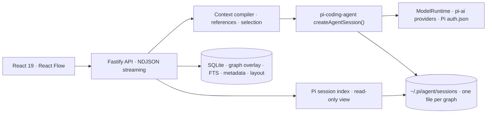

<div align="center">
  

  <h1>Pi Graph Chat</h1>

  <p><strong>Learn in branches. Remember in graphs. Built on Pi.</strong></p>
  <p>A personal, local-first learning workspace that turns AI conversations into a knowledge graph and shows your Pi coding-agent sessions as trees.</p>

  <p><strong>English</strong> · <a href="./README.zh-CN.md">简体中文</a></p>

  <p>
    
    
    
    
    
  </p>
</div>

<br />

Pi Graph Chat is a tool I build for my own learning. It is not a product and does
not try to be one. Two ideas hold it together:

1. **A conversation should be a graph, not a list.** Branch from any node, explore
   an idea in its own context, then reference several branches to ask a new
   question. Every answer keeps the context it actually used.
2. **Pi is the runtime.** The [Pi agent ecosystem](https://github.com/earendil-works/pi)
   already has a tree-shaped session format, thirty-plus providers, extensions,
   skills, and a coding agent. Pi Graph Chat leans on that instead of rebuilding it.

<div align="center">
  
  
</div>

## What it does today

| Area | Current implementation |
| --- | --- |
| Knowledge graphs | Infinite React Flow canvas, branch and continuation edges, cross-branch references, synthesis nodes, search |
| Pi-backed graphs | Every graph is a Pi session file; a branch in the graph is a branch in the session tree, and **Open in terminal** resumes it with `pi --session` |
| Precise follow-ups | Continue from any node, or select text inside an answer and branch from that phrase |
| Context | The parent path is the session's active branch; references and selected text are injected as a Pi `custom_message` entry |
| Pi sessions | Read-only tree view of every Pi coding-agent session on this machine, auto-refreshing while Pi runs |
| Codebase-rooted graphs | Give a graph a project directory: its Pi session lives in that project and answers get Pi's read-only `read`, `grep`, `find`, `ls` tools plus the project's `AGENTS.md` |
| Cross-session references | Cite a node from another graph or a turn from any terminal Pi session in the next question; they travel as chips in the composer |
| Pi package | `packages/pi-extension` gives the terminal `pi` the graph tools, `/graph`, `/ref`, four learning skills, and two prompt templates |
| Your Pi setup | Graph runs load your own Pi extensions, skills, prompt templates, and packages through Pi's normal discovery |
| Models via Pi | ChatGPT subscription (Codex OAuth), OpenAI, Anthropic, Google Gemini, OpenRouter, DeepSeek, Ollama, any OpenAI-compatible endpoint |
| Local data | Bun/Node SQLite with FTS5, versioned JSON backup, Obsidian-friendly Markdown export |
| Import | Markdown, plain text, and text-based PDF |
| Study | Knowledge metadata, study cards, local graph metrics |
| Interface | English and Simplified Chinese, light and dark themes |

### Pi sessions

Run `pi` in any project. Pi stores the conversation as an append-only tree in
`~/.pi/agent/sessions/`. Pi Graph Chat reads those files and shows each session
as a tree of turns: one card per prompt plus the assistant work that followed,
with abandoned branches, tool calls, thinking, labels, and the current position.

- Click a session in the sidebar to open it. The view refreshes every few seconds,
  so a running `pi` session grows on the canvas as you work.
- **Open in terminal** copies `cd <cwd> && pi --session <file>` so you can
  continue the same session with Pi's full coding tools.
- The view is read-only. Pi owns the session file.

Set `PI_CODING_AGENT_SESSION_DIR` (or `PI_CODING_AGENT_DIR`) if your sessions
live somewhere else; Pi Graph Chat follows the same precedence as Pi.

### Round trip with the terminal

Turns you add to a graph's session in the terminal come back as nodes the next
time the graph is opened: each prompt becomes a node under the node whose
answer it continued, tagged `pi-terminal`. The Pi session view shows
**Open graph** for any session that backs a graph.

Sessions the app created for its graphs stay out of the **Pi sessions** list;
they are reached through the graph itself. Deleting an archived graph for good
also deletes that session file. A terminal session bound to a graph with
`/graph use` keeps showing in the list and is never deleted by the app.

Do not keep `pi` open on a graph's session while asking questions in the web
app. Pi session files are append-only and single-writer, and two writers can
interleave entries. Finish in one place, then continue in the other.

If `pi` is not on your PATH, install it with
`npm install -g @earendil-works/pi-coding-agent` (Node.js 22.19+).

### Graphs rooted in a codebase

Give a graph a project directory when you create or edit it. From then on:

- the graph's Pi session is stored under that project, so `pi --resume` there
  finds it and **Open in terminal** starts Pi in the project;
- answers can `read`, `grep`, `find`, and `ls` the project's files, and the
  system prompt tells the model to ground implementation questions in the
  actual code and cite paths;
- the project's `AGENTS.md` context files are loaded, as they are for `pi`.

Tools stay read-only. Graphs without a project directory only get `read`, which
is what Pi skills need.

### References across graphs and sessions

Two ways to pull outside context into the next question:

- Mark nodes as references, then switch graphs or start a new thread. The
  references follow you as chips in the composer and are cited from the other
  graph.
- Open a terminal Pi session in the sidebar, select a turn, and click **Use as
  reference**. The turn's prompt, tools, and answer become context for the next
  graph question.

Both kinds are recorded in the node's context snapshot and injected into the Pi
session as a `pi-graph-chat.references` entry, exactly like same-graph references.

### The Pi package

```bash
pi install ./packages/pi-extension
```

This gives the terminal `pi` the `graph_search` and `graph_get_node` tools,
`/graph` (open the current session in the web app, or bind a plain session to
a graph), `/ref` (inject a graph node into context), the `graph-synthesize`,
`graph-compare`, `explain-back`, and `study-cards` skills, and the `/branch`
and `/synthesize` prompts. See [`packages/pi-extension/README.md`](./packages/pi-extension/README.md).

Graph runs in the web app go through Pi's normal resource discovery, so your
`~/.pi/agent` extensions, skills, prompt templates, and installed packages are
active there too. Set `PI_GRAPH_CHAT_PI_EXTENSIONS=0` to run graphs without
extensions.

## Quick start

Bun 1.3+ is required for development. Node.js 22.19+ can run the built server.

```bash
git clone https://github.com/everettjf/pi-graph-chat.git
cd pi-graph-chat
bun install
bun run launch
```

`bun run launch` builds the application, starts the local service on
`http://127.0.0.1:4317`, and opens it in your browser. For hot reload use
`bun run dev` and open [http://localhost:5173](http://localhost:5173).

### macOS menu bar app

The quickest way to get the app is Homebrew:

```bash
brew install --cask everettjf/tap/pi-graph-chat
```

A signed and notarized Apple Silicon build is also attached to every
[release](https://github.com/everettjf/pi-graph-chat/releases/latest): unzip,
move `Pi Graph Chat.app` to Applications, and launch. To build it yourself:

```bash
bun run app:build
```

This packages the same server as a menu bar app in `dist-app/Pi Graph Chat.app`
(plus `Pi-Graph-Chat-<version>.zip`): it lives in the status bar with no Dock icon, keeps its data in
`~/Library/Application Support/Pi Graph Chat`, writes logs to
`~/Library/Logs/Pi Graph Chat/server.log`, restarts the server if it crashes,
and opens the browser on click. The packaging lives in
[`packages/bun-menubar`](./packages/bun-menubar/README.md) and is configured
by [`menubar.config.ts`](./menubar.config.ts). Xcode command line tools are
needed the first time, to build the native shell.

The default build is signed ad hoc, which only opens on the machine that built
it. To sign and notarize for distribution:

1. Sign with your Developer ID certificate. The identity comes from the
   environment so it never lands in the repository:

   ```bash
   MENUBAR_SIGN_IDENTITY="Developer ID Application: Your Name (TEAMID)" bun run app:build
   ```

   This turns on the hardened runtime, timestamps the signature, and gives the
   server binary the entitlements Bun's JIT needs.

2. Store notarization credentials once in the keychain (an app-specific
   password from appleid.apple.com), then build with the profile:

   ```bash
   xcrun notarytool store-credentials pi-graph-chat --apple-id you@example.com --team-id TEAMID
   MENUBAR_SIGN_IDENTITY="Developer ID Application: Your Name (TEAMID)" \
   MENUBAR_NOTARY_PROFILE=pi-graph-chat bun run app:build
   ```

   The build submits the zip to Apple, waits for the verdict, staples the
   ticket to the app, and zips again. Pass `--skip-notarize` to the CLI to skip
   the round trip. The same settings can be written under `sign` and
   `notarize` in `menubar.config.ts`; passwords are only ever read from
   `MENUBAR_NOTARY_PASSWORD`.

3. Publish: attach `dist-app/Pi-Graph-Chat-<version>.zip` to the GitHub
   release, then update the Homebrew cask in
   [everettjf/homebrew-tap](https://github.com/everettjf/homebrew-tap):

   ```bash
   bun scripts/homebrew-cask.mjs   # writes Casks/pi-graph-chat.rb into the local tap checkout
   ```

   It reads the version from `package.json` and the sha256 from the zip; commit
   and push the tap afterwards.

The app uses port 4317, like `bun run launch`; stop one before starting the other.

On first launch, Pi Graph Chat creates an example graph about RAG that runs
without any credentials. Data lives in `.pi-graph-chat/`; set `PI_GRAPH_CHAT_DATA_DIR`
to move it.

## Models

Open **Models & settings** in the sidebar. Every provider is served by Pi's
`pi-ai` layer, and the model field suggests the models Pi knows for the chosen
provider (Pi's catalog plus your `models.json`); any other id can be typed.
Ollama lists the models installed locally instead.

| Provider | Authentication |
| --- | --- |
| ChatGPT | Device-code OAuth through Pi's `openai-codex` provider; reuses an existing Codex CLI login when present |
| OpenAI | `OPENAI_API_KEY` or an in-process key |
| Anthropic | `ANTHROPIC_API_KEY` or an in-process key |
| Google Gemini | `GEMINI_API_KEY` or an in-process key |
| OpenRouter | `OPENROUTER_API_KEY` or an in-process key |
| DeepSeek | `DEEPSEEK_API_KEY` or an in-process key |
| Ollama | No key; `http://127.0.0.1:11434/v1` |
| Custom | Any OpenAI-compatible endpoint, optional in-process key |

Credentials are Pi's. ChatGPT sign-in from the settings dialog writes to Pi's
own `~/.pi/agent/auth.json`, so a login made here also works in the terminal
and a `pi /login` made in the terminal also works here. Keys typed into the
settings dialog stay in the server process and are never written to SQLite,
exports, logs, or `auth.json`. Set `PI_CODING_AGENT_DIR` to point both Pi and
Pi Graph Chat at a different agent directory.

## Architecture



The Pi session file is the conversation of record. SQLite keeps what Pi does
not know about: node positions, summaries, tags, mastery, references, and the
full-text index. On the first answer in a graph, existing nodes are replayed
into a new session so the tree matches; after that, each answer branches the
session at the parent node's entry.

Core code:

- [`server/agent-runtime.ts`](./server/agent-runtime.ts) — `createAgentSession()` runs, provider routing through `ModelRuntime`, graph tools, streaming events
- [`server/graph-session.ts`](./server/graph-session.ts) — opens or creates a graph's Pi session and replays nodes into it
- [`server/context-compiler.ts`](./server/context-compiler.ts) — reference and selection context
- [`server/pi-sessions.ts`](./server/pi-sessions.ts) — Pi session index and turn collapsing
- [`packages/pi-extension/extensions/pi-graph-chat.ts`](./packages/pi-extension/extensions/pi-graph-chat.ts) — the terminal-side extension
- [`server/openai-codex-auth.ts`](./server/openai-codex-auth.ts) — ChatGPT device-code OAuth lifecycle
- [`src/components/graph-canvas.tsx`](./src/components/graph-canvas.tsx) — knowledge graph interactions
- [`src/components/pi-session-view.tsx`](./src/components/pi-session-view.tsx) — Pi session tree view

## Development

```bash
bun run typecheck  # TypeScript client, server, and the Pi package
bun run test       # Vitest: database, Pi runtime, Pi auth, Pi sessions, Pi package, UI
bun run build      # production build
bun run test:e2e   # Playwright
bun run test:all   # everything above
```

Run Vitest through the package scripts. They force Bun's runtime because the
database relies on SQLite FTS5; a Node SQLite build without FTS5 produces
misleading failures.

## Roadmap

The plan is to make Pi's session file the single source of truth and let Pi
Graph Chat add the graph layer on top. In order:

1. Read-only Pi session bridge — done.
2. Answers run through `createAgentSession()`; graph branches are Pi session
   branches and the same session opens in the terminal — done.
3. Ship the graph tools, `/graph` command, and study skills as a Pi package,
   and load the user's Pi extensions and skills into graph runs — done.
4. Root learning sessions in a codebase with Pi's read-only coding tools and
   reference nodes across graphs and sessions — done.
5. Next: show tool calls on graph nodes, spaced-repetition review over study
   cards, and local embeddings for related-node suggestions across graphs.

See [`docs/CORE_TESTING.md`](./docs/CORE_TESTING.md) for manual acceptance and
[`docs/FORMAT.md`](./docs/FORMAT.md) for the backup format.

## License

[MIT](./LICENSE) © Everett

[Discord](https://discord.gg/eGzEaP6TzR)
