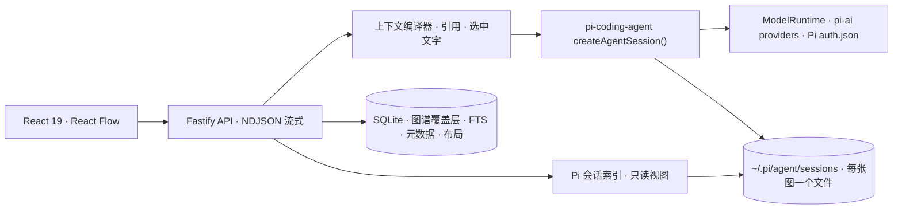

<div align="center">
  

  <h1>Pi Graph Chat</h1>

  <p><strong>在分支中学习，在图谱中记忆，运行在 Pi 之上。</strong></p>
  <p>一个自用的本地优先学习工作区：把 AI 对话变成知识图，并把 Pi coding agent 的会话显示成树。</p>

  <p><a href="./README.md">English</a> · <strong>简体中文</strong></p>

  <p>
    
    
    
    
    
  </p>
</div>

<br />

Pi Graph Chat 是我给自己做的学习工具，不是产品，也不打算做成产品。它建立在两个想法上：

1. **对话应该是图，而不是列表。** 从任意节点分支，在分支里深入一个概念，再引用多个分支提出新问题。每次回答都保留它实际使用的上下文。
2. **Pi 就是运行时。** [Pi agent 生态](https://github.com/earendil-works/pi) 已经有树状会话格式、三十多个 provider、扩展、skills 和 coding agent。Pi Graph Chat 直接依赖它们，而不是重新实现。

<div align="center">
  
  
</div>

## 现在能做什么

| 方向 | 当前实现 |
| --- | --- |
| 知识图 | React Flow 无限画布、分支边与续接边、跨分支引用、综合节点、搜索 |
| Pi 承载的图 | 每张图就是一个 Pi 会话文件；图里的分支就是会话树的分支，**在终端打开** 会用 `pi --session` 接着聊 |
| 精确追问 | 从任意节点继续，或选中回答里的一段文字从那句话分支 |
| 上下文 | 父路径就是会话的当前分支；引用和选中文字以 Pi 的 `custom_message` 条目注入 |
| Pi 会话 | 只读显示本机所有 Pi coding agent 会话的树，Pi 运行时自动刷新 |
| 根植于代码库的图 | 给图指定项目目录：Pi 会话放在该项目下，回答可用 Pi 的只读工具 `read`、`grep`、`find`、`ls`，并加载项目的 `AGENTS.md` |
| 跨会话引用 | 下一个问题可以引用其他图的节点，或任意终端 Pi 会话的某个回合；它们以芯片的形式出现在输入框里 |
| Pi package | `packages/pi-extension` 给终端 `pi` 提供图谱工具、`/graph`、`/ref`、四个学习 skills 和两个 prompt 模板 |
| 你的 Pi 配置 | 图谱运行通过 Pi 的正常发现机制加载你自己的扩展、skills、prompt 模板和已安装的 package |
| 通过 Pi 使用模型 | ChatGPT 订阅（Codex OAuth）、OpenAI、Anthropic、Google Gemini、OpenRouter、DeepSeek、Ollama、任意 OpenAI-compatible endpoint |
| 本地数据 | Bun/Node SQLite + FTS5、版本化 JSON 备份、Obsidian 友好的 Markdown 导出 |
| 导入 | Markdown、纯文本、文本型 PDF |
| 学习 | 知识元数据、学习卡片、本地图谱指标 |
| 界面 | 英文和简体中文，浅色和深色主题 |

### Pi 会话

在任何项目里运行 `pi`，Pi 会把对话以只追加的树保存在 `~/.pi/agent/sessions/`。Pi Graph Chat 读取这些文件，把每个会话显示成回合树：每个提问一张卡片，连同它后面的助手工作，包括被放弃的分支、工具调用、思考过程、标签和当前位置。

- 在侧边栏点击一个会话即可打开。视图每隔几秒刷新，正在运行的 `pi` 会话会随着你的操作在画布上生长。
- **在终端打开** 会复制 `cd <cwd> && pi --session <file>`，你可以带着 Pi 完整的编码工具继续同一个会话。
- 视图是只读的，会话文件由 Pi 负责写入。

如果会话不在默认位置，设置 `PI_CODING_AGENT_SESSION_DIR`（或 `PI_CODING_AGENT_DIR`），优先级与 Pi 本身一致。

### 与终端的往返

在终端里给图的会话追加的回合，下次打开这张图时会变成节点：每个提问成为它所续接回答的子节点，带 `pi-terminal` 标签。Pi 会话视图对所有对应某张图的会话显示 **打开图谱**。

应用为图创建的会话不会出现在 **Pi 会话** 列表里，它们从图本身进入。永久删除已归档的图时，这个会话文件也会一起删除。用 `/graph use` 绑定到图的终端会话仍会显示在列表里，应用不会删除它。

不要在终端里开着图的会话的同时在网页里提问。Pi 会话文件是只追加、单写者的，两个写入方会交错条目。在一处做完，再到另一处继续。

如果 `pi` 不在 PATH 里，用 `npm install -g @earendil-works/pi-coding-agent` 安装（需要 Node.js 22.19+）。

### 根植于代码库的图

创建或编辑图时填写项目目录。之后：

- 这张图的 Pi 会话会保存在该项目下，在项目里 `pi --resume` 能找到它，**在终端打开** 也会在项目目录启动 Pi；
- 回答可以 `read`、`grep`、`find`、`ls` 项目文件，系统提示会要求模型基于真实代码回答实现问题并引用路径；
- 项目的 `AGENTS.md` 上下文文件会像 `pi` 一样被加载。

工具全部只读。没有项目目录的图只有 `read`，这是 Pi skills 所需要的。

### 跨图和跨会话引用

把外部上下文带进下一个问题有两种方式：

- 先把节点标记为引用，再切换图或新建线程。引用会以芯片的形式跟着你进入输入框，并注明来自哪张图。
- 在侧边栏打开一个终端 Pi 会话，选中一个回合，点击 **作为引用**。该回合的提问、工具和回答会成为下一个图谱问题的上下文。

两种引用都会记录在节点的上下文快照里，并以 `pi-graph-chat.references` 条目注入 Pi 会话，与同图引用完全一样。

### Pi package

```bash
pi install ./packages/pi-extension
```

这会给终端 `pi` 提供 `graph_search` 和 `graph_get_node` 工具、`/graph`（在网页里打开当前会话，或把普通会话绑定到某张图）、`/ref`（把图谱节点注入上下文）、`graph-synthesize`、`graph-compare`、`explain-back`、`study-cards` 四个 skills，以及 `/branch` 和 `/synthesize` 两个 prompt。详见 [`packages/pi-extension/README.md`](./packages/pi-extension/README.md)。

网页里的图谱运行走 Pi 的正常资源发现，所以 `~/.pi/agent` 下的扩展、skills、prompt 模板和已安装的 package 在这里同样生效。设置 `PI_GRAPH_CHAT_PI_EXTENSIONS=0` 可以在不加载扩展的情况下运行图谱。

## 快速开始

开发需要 Bun 1.3+；Node.js 22.19+ 可以运行构建后的服务。

```bash
git clone https://github.com/everettjf/pi-graph-chat.git
cd pi-graph-chat
bun install
bun run launch
```

`bun run launch` 会构建应用、在 `http://127.0.0.1:4317` 启动本地服务并打开浏览器。需要热更新时运行 `bun run dev`，再打开 [http://localhost:5173](http://localhost:5173)。

### macOS 菜单栏 app

最省事的安装方式是 Homebrew：

```bash
brew install --cask everettjf/tap/pi-graph-chat
```

每个 [release](https://github.com/everettjf/pi-graph-chat/releases/latest) 也都附带已签名并公证的 Apple Silicon 版本：解压后把 `Pi Graph Chat.app` 拖进「应用程序」即可运行。自己构建：

```bash
bun run app:build
```

这会把同一个服务打包成菜单栏 app，输出到 `dist-app/Pi Graph Chat.app`（另有 `Pi-Graph-Chat-<版本>.zip`）：它常驻状态栏、不显示 Dock 图标，数据保存在 `~/Library/Application Support/Pi Graph Chat`，日志写到 `~/Library/Logs/Pi Graph Chat/server.log`，服务崩溃会自动重启，点击即打开浏览器。打包逻辑在 [`packages/bun-menubar`](./packages/bun-menubar/README.md)，配置在 [`menubar.config.ts`](./menubar.config.ts)。第一次构建需要 Xcode 命令行工具来编译原生壳。

默认构建是 ad-hoc 签名，只能在构建它的机器上打开。要分发给别人，需要签名和公证：

1. 用 Developer ID 证书签名。身份从环境变量读取，不会进入仓库：

   ```bash
   MENUBAR_SIGN_IDENTITY="Developer ID Application: Your Name (TEAMID)" bun run app:build
   ```

   这会开启 hardened runtime、给签名加时间戳，并给 server 二进制加上 Bun JIT 所需的 entitlements。

2. 把公证凭据存进钥匙串（密码用 appleid.apple.com 生成的 App 专用密码），之后带上 profile 构建：

   ```bash
   xcrun notarytool store-credentials pi-graph-chat --apple-id you@example.com --team-id TEAMID
   MENUBAR_SIGN_IDENTITY="Developer ID Application: Your Name (TEAMID)" \
   MENUBAR_NOTARY_PROFILE=pi-graph-chat bun run app:build
   ```

   构建会把 zip 提交给 Apple、等待结果、把票据 staple 到 app 里，再重新打 zip。给 CLI 传 `--skip-notarize` 可跳过这一步。同样的设置也可以写在 `menubar.config.ts` 的 `sign` 和 `notarize` 里；密码只会从 `MENUBAR_NOTARY_PASSWORD` 读取。

3. 发布：把 `dist-app/Pi-Graph-Chat-<版本>.zip` 上传到 GitHub release，然后更新 [everettjf/homebrew-tap](https://github.com/everettjf/homebrew-tap) 里的 cask：

   ```bash
   bun scripts/homebrew-cask.mjs   # 把 Casks/pi-graph-chat.rb 写进本机的 tap 检出
   ```

   版本号来自 `package.json`，sha256 来自 zip；之后在 tap 里提交并推送。

app 和 `bun run launch` 一样使用 4317 端口，两者不要同时运行。

首次运行会创建一张关于 RAG 的示例图，不需要任何凭据。数据保存在 `.pi-graph-chat/`，可用 `PI_GRAPH_CHAT_DATA_DIR` 更改位置。

## 模型

打开侧边栏的「模型与设置」。所有 provider 都由 Pi 的 `pi-ai` 层提供；模型输入框会列出 Pi 知道的该 provider 的模型（Pi 的内置目录加上你的 `models.json`），也可以直接输入其他 id。Ollama 列出的是本机已安装的模型。

| Provider | 认证方式 |
| --- | --- |
| ChatGPT | 通过 Pi 的 `openai-codex` provider 走设备码 OAuth；已有 Codex CLI 登录时会复用 |
| OpenAI | `OPENAI_API_KEY` 或进程内输入 |
| Anthropic | `ANTHROPIC_API_KEY` 或进程内输入 |
| Google Gemini | `GEMINI_API_KEY` 或进程内输入 |
| OpenRouter | `OPENROUTER_API_KEY` 或进程内输入 |
| DeepSeek | `DEEPSEEK_API_KEY` 或进程内输入 |
| Ollama | 无需密钥；`http://127.0.0.1:11434/v1` |
| 自定义 | 任意 OpenAI-compatible endpoint，可选进程内密钥 |

凭据就是 Pi 的凭据。在设置里登录 ChatGPT 会写入 Pi 自己的 `~/.pi/agent/auth.json`，所以这里登录一次终端也能用，终端里 `pi /login` 过这里也能用。设置里输入的 API Key 只留在服务进程，不会写入 SQLite、导出文件、日志或 `auth.json`。设置 `PI_CODING_AGENT_DIR` 可以让 Pi 和 Pi Graph Chat 一起使用另一个 agent 目录。

## 架构



Pi 会话文件是对话的正本。SQLite 只保存 Pi 不知道的东西：节点位置、摘要、标签、掌握度、引用关系和全文索引。一张图第一次运行回答时，已有节点会被回放进新建的会话，让树结构一致；之后每次回答都从父节点对应的条目分支。

核心代码：

- [`server/agent-runtime.ts`](./server/agent-runtime.ts) — `createAgentSession()` 运行、通过 `ModelRuntime` 路由 provider、图谱工具、流式事件
- [`server/graph-session.ts`](./server/graph-session.ts) — 打开或创建图对应的 Pi 会话，并把节点回放进去
- [`server/context-compiler.ts`](./server/context-compiler.ts) — 引用与选中文字的上下文
- [`server/pi-sessions.ts`](./server/pi-sessions.ts) — Pi 会话索引与回合折叠
- [`packages/pi-extension/extensions/pi-graph-chat.ts`](./packages/pi-extension/extensions/pi-graph-chat.ts) — 终端侧扩展
- [`server/openai-codex-auth.ts`](./server/openai-codex-auth.ts) — ChatGPT 设备码 OAuth 生命周期
- [`src/components/graph-canvas.tsx`](./src/components/graph-canvas.tsx) — 知识图交互
- [`src/components/pi-session-view.tsx`](./src/components/pi-session-view.tsx) — Pi 会话树视图

## 开发

```bash
bun run typecheck  # TypeScript 客户端、服务端和 Pi package
bun run test       # Vitest：数据库、Pi runtime、Pi 登录、Pi 会话、Pi package、UI
bun run build      # 生产构建
bun run test:e2e   # Playwright
bun run test:all   # 以上全部
```

请通过 package 脚本运行 Vitest。脚本强制使用 Bun 运行时，因为数据库依赖 SQLite FTS5；没有 FTS5 的 Node SQLite 会产生误导性的失败。

## 路线图

目标是让 Pi 的会话文件成为唯一真相源，Pi Graph Chat 只在上面加图谱层。顺序如下：

1. 只读的 Pi 会话桥 —— 已完成。
2. 回答通过 `createAgentSession()` 运行，图谱分支就是 Pi 会话分支，同一个会话可以在终端打开 —— 已完成。
3. 把图谱工具、`/graph` 命令和学习 skills 打包成 Pi package，并在图谱运行中加载用户自己的 Pi 扩展和 skills —— 已完成。
4. 让学习会话根植于代码库，使用 Pi 的只读编码工具，并支持跨图、跨会话引用 —— 已完成。
5. 下一步：在图节点上显示工具调用、基于学习卡片的间隔重复复习、用本地 embedding 做跨图相关节点推荐。

手动验收见 [`docs/CORE_TESTING.md`](./docs/CORE_TESTING.md)，备份格式见 [`docs/FORMAT.md`](./docs/FORMAT.md)。

## License

[MIT](./LICENSE) © Everett

[Discord](https://discord.gg/eGzEaP6TzR)
